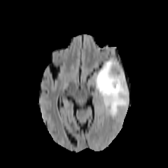
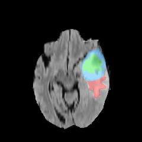

# MedSeg: Medical Segmentation Training, Benchmarking & Deployment

A research-engineering workbench for training, evaluating, benchmarking, and deploying medical image segmentation models across PyTorch, ONNX Runtime, CPU/GPU, CLI, and API-based settings.

## Snapshot (Axial T1, same slice)

Single axial slice from raw BraTS data, shown as plain T1 and T1 with ground-truth overlap.

<p align="center">
    
    
</p>


## Project scope

MedSeg focuses on the engineering path around medical image segmentation models: training, evaluation, inference, benchmarking, deployment-oriented execution, and structured output generation.

It is not a mobile application, not a clinically validated system, and not intended to claim state-of-the-art segmentation performance.

## Features

- Configurable training for 2D and 3D U-Net segmentation variants.
- Medical image preprocessing and augmentation utilities.
- Evaluation utilities for segmentation quality analysis.
- Batch prediction with a PyTorch inference path.
- ONNX export and ONNX Runtime inference experiments.
- Latency, memory, model-size, and quality benchmarking.
- Optional quantization experiments for CPU-constrained inference.
- FastAPI serving path for deployment-oriented testing.
- Structured summary generation from segmentation outputs.

## Status

| Component | Status | Notes |
|---|---|---|
| Training pipeline | Done | 2D / 3D U-Net variants with configurable runs |
| Evaluation | Done | Segmentation-quality metrics over saved cases |
| Batch prediction | Done | CLI wrapper for checkpoint-based inference |
| ONNX export | Done | Export available with parity validation workflow |
| Quantization | Done | Optional CPU-constrained benchmark workflow |
| API deployment | Done | Minimal FastAPI wrapper for model inference |
| Benchmarking | Done | Runtime + memory + environment outputs |
| Structured reporting | Done | Deterministic summary and optional LLM rewrite |
| CI/tests | Done | Existing checks and coverage for core workflows |

## Repository layout

```text
src/
    base_train.py
    train.py
    eval.py
    predict.py
    serve.py
    benchmark.py
    export.py
    quantize.py
    report.py
    model.py
    dataset.py
    transforms.py
    loss.py
    optim.py
    config.py
    utils.py

config/Task01_BrainTumour/
scripts/
outputs/
resources/
```

## Install

```bash
pip install -e ".[onnx]"
```

Optional full extras:

```bash
pip install -e ".[onnx,llm]"
```

## Reviewer quickstart

```bash
git clone https://github.com/elebot4/on-device-medical-seg
cd on-device-medical-seg

pip install -e ".[onnx]"

# Expected raw data source: BraTS under data/raw/Task01_BrainTumour
python scripts/prepare.py --raw_dir ./data/raw/Task01_BrainTumour --save_dir ./data/processed

# Training (config-first style)
python src/train.py config/Task01_BrainTumour/2d_axi.py

# Evaluation on saved run directory
python src/eval.py --eval_dir outputs/Task01_2d_axi_jun03 --do_surface

# Single-volume prediction
python src/predict.py --backend pytorch --checkpoint outputs/Task01_2d_axi_jun03/checkpoints/ckpt_best.pt --input data/processed/Task01_BrainTumour/BRATS_001/image.npy --output outputs/demo/brats_001_pred.npy --summary outputs/demo/brats_001_summary.json

# Benchmark (PyTorch CPU and ONNX CPU)
python src/benchmark.py --checkpoint outputs/Task01_2d_axi_jun03/checkpoints/ckpt_best.pt --input_dir data/processed/Task01_BrainTumour --labels_dir data/processed/Task01_BrainTumour --backends pytorch_cpu onnx_cpu --output docs/benchmarks/results.csv

# API serve
python src/serve.py --backend pytorch --checkpoint outputs/Task01_2d_axi_jun03/checkpoints/ckpt_best.pt --device cpu --host 0.0.0.0 --port 8080
```

This workflow validates software behavior and deployment tradeoffs. It is not intended to demonstrate clinical segmentation performance.

## Quantization status

Quantization is included as an exploratory experiment for CPU-constrained inference. It is not required for the main training, benchmarking, and deployment workflow.

Current focus:

- Measure latency changes.
- Measure model-size changes.
- Quantify segmentation-quality degradation.

## Benchmark snapshot (CPU)

The following comparison was run with identical settings across backends:

- Input: `data/benchmark/synthetic_case/image.npy` (single synthetic case, shape `(4, 8, 256, 256)`)
- Warmup: `1`
- Cases: `1`
- Device: CPU

Artifacts:

- FP32/ONNX: `results/benchmark_comparison/fp32/results.csv`
- Quantized: `results/benchmark_comparison/quantized/results.csv`

| Backend | Mean latency (ms) | Peak RAM (MB) | Model size (MB) | Relative speed vs FP32 PyTorch |
|---|---:|---:|---:|---:|
| PyTorch CPU (FP32) | 8433.504 | 663.85 | 64.631 | 1.00x |
| ONNX Runtime CPU | 2192.936 | 810.62 | 32.579 | 3.85x faster |
| PyTorch CPU (Quantized PTQ) | 9163.939 | 647.88 | 32.320 | 0.92x (slower) |

Interpretation:

- ONNX Runtime is faster than FP32 PyTorch on this setup.
- PTQ reduced model size by about 50% (`64.631 MB -> 32.320 MB`) with slightly lower peak RAM.
- PTQ did not improve latency in this run, which is backend and workload dependent.

## License

MIT License (see LICENSE.md)
